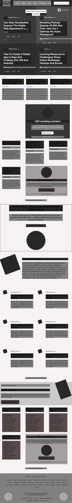

# Design-Teardown

This project is the heatmap of the smashing magazine website. In this me and my partner uses grid, flexbox to make website flexible.

## Project Design

Project Design Screenshot : 

## Built With

- HTML5
- CSS3
- Google font

## Original Website

[Original website link](https://www.smashingmagazine.com/)

## Live Demo

[Live Demo Link](https://raw.githack.com/rida-elbahtouri/Design-Teardown/features-branch/index.html)


# Github link:

For the: [Github-link](https://github.com/rida-elbahtouri/Design-Teardown/tree/features-branch)

# Getting Started 🚀

These instructions will get you a copy of the project up and running on your local machine.

## How To Use 🔧

From your command line, first clone the project:

```bash
# Clone this repository
$ git clone https://github.com/rida-elbahtouri/Design-Teardown.git

# Go into the repository
$ cd Design-Teardown

```

## CONTRIBUTOR

👤 **Dipesh Kumar**

- [Github](@Dipeshtwis)
- [Twitter](@97deepeshkumar)
- [Linkedin](https://www.linkedin.com/in/dipesh-kumar-b6ab88134/)

👤 **Rida Elbahtouri**

- [Github](https://github.com/rida-elbahtouri)
- [Twitter](https://twitter.com/RElbahtouri)
- [Linkedin](https://www.linkedin.com/in/rida-elbahtouri-36a8a7185/)

## Show your support

Give a ⭐️ if you like this project!

## Acknowledgments

- Thanks to Microverse and The Odin Project.
